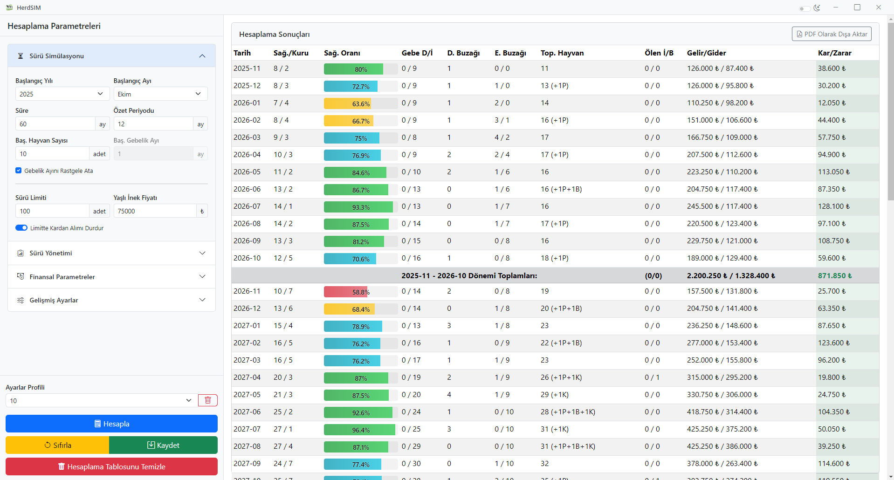

# 🐄 HerdSIM

**HerdSIM**, büyükbaş hayvancılık yapan işletmeler için geliştirilmiş Python destekli bir masaüstü sürü simülasyon aracıdır. Kullanıcılar başlangıç hayvan sayısı, yem giderleri, süt verimi, buzağı oranı gibi birçok parametreyi girerek gelecekteki kârlılık, sürü büyüklüğü ve hayvan döngüsünü detaylı bir şekilde simüle edebilir.

**HerdSIM** is a desktop herd simulation tool powered by Python, developed for cattle breeding businesses. Users can enter various parameters such as initial number of animals, feed costs, milk yield, and calving rate to simulate future profitability, herd size, and animal cycle in detail.

---

## 🇹🇷 Özellikler / 🇬🇧 Features

- 🧮 **Detaylı Parametre Girişi / Detailed Parameter Input:** Gebelik, yem gideri, çalışan maaşı vb. / Pregnancy, feed cost, staff salary, etc.
- 📈 **Aylık Simülasyon / Monthly Simulation:** Süt üretimi, buzağı sayısı, gelir/gider ve kâr hesaplaması / Milk production, calf count, profit/loss calculation.
- 🔄 **Gelişmiş Seçenekler / Advanced Options:** Otomatik buzağıdan inek ekleme, kardan alım, ölüm oranları / Auto calf-to-cow conversion, profit-based cow purchase, death ratios.
- 📤 **PDF Dışa Aktarma / PDF Export:** Hesaplama sonuçlarını PDF olarak dışa aktarma / Export simulation results as PDF.
- 🌗 **Tema Desteği / Theme Support:** Karanlık ve aydınlık tema desteği / Dark and light theme support.
- 💾 **Profil Yönetimi / Profile Management:** Profil kaydetme ve geri yükleme / Profile save and load support.
- 🖥️ **Modern Mimari / Modern Architecture:** Electron + Python ile modern masaüstü uygulama mimarisi / Modern desktop architecture with Electron + Python backend.

---

## 🚀 Kurulum / Setup

### Gerekli Bağımlılıklar / Requirements

- **Node.js** (v16+)
- **Python** (v3.9+)
- **Git**

### Kurulum Adımları / Installation Steps

1.  **Projeyi klonlayın / Clone the repository:**
    ```bash
    git clone https://github.com/user/herd-sim.git
    cd herd-sim
    ```
    *(Not: Depo URL'sini doğru olanla güncelleyin. / Note: Update the repository URL with the correct one.)*

2.  **Python bağımlılıklarını yükleyin / Install Python dependencies:**
    ```bash
    pip install -r requirements.txt
    ```

3.  **Python betiğini çalıştırılabilir dosyaya çevirin / Compile the Python script into an executable:**
    Uygulamanın Electron arayüzü ile iletişim kurabilmesi için Python simülasyon motorunun `.exe` dosyasına dönüştürülmesi gerekir.
    For the application to communicate with the Electron frontend, the Python simulation engine needs to be compiled into an `.exe` file.
    ```bash
    pyinstaller --onefile herd_calculator.py -n herd_calculator
    ```
    > Bu komut, `dist` klasörü altında `herd_calculator.exe` dosyasını oluşturacaktır. `main.js` bu dosyayı kullanacak şekilde ayarlanmıştır.
    > This command will create `herd_calculator.exe` under the `dist` folder. `main.js` is configured to use this file.

4.  **Node.js modüllerini yükleyin / Install Node.js dependencies:**
    ```bash
    npm install
    ```

5.  **Uygulamayı başlatın / Run the application:**
    ```bash
    npm start
    ```

---

## 🖼️ Ekran Görüntüleri / Screenshots

<table>
  <tr>
    <td align="center"><b>Türkçe Arayüz / Turkish Interface</b></td>
    <td align="center"><b>English Interface</b></td>
  </tr>
  <tr>
    <td></td>
    <td></td>
  </tr>
</table>

---

## 📁 Proje Yapısı / Project Structure

```bash
# Node modüllerini yükleyin / Install Node dependencies
npm install

# Uygulamayı başlatın / Run the application
npm start
```

> `herd_calculator.py` dosyası çalıştırılırken `.exe`'ye çevrilmiş olmalı. Bunun için `pyinstaller` ile derleyebilirsiniz:

```bash
pyinstaller --onefile herd_calculator.py -n herd_calculator
```

> Oluşan `herd_calculator.exe`, `main.js` tarafından Electron arayüzü ile haberleşerek simülasyonu çalıştırır.

---

## 🖼️ Ekran Görüntüleri / Screenshots

### Türkçe Arayüz


### English Interface


---

## 📁 Proje Yapısı / Project Structure

```
herd-sim/
├── assets/                 # Uygulama ikonları ve logolar
├── index.html              # Uygulama arayüzü
├── main.js                 # Electron ana süreç
├── herd_calculator.py      # Simülasyon motoru (Python)
├── splash.html             # Açılış ekranı (isteğe bağlı)
├── node_modules/
├── package.json
└── README.md
```

---

## 📃 Lisans / License

MIT Lisansı

Bu projeyi özgürce kullanabilir, geliştirebilir ve dağıtabilirsiniz.

---

## 👤 Geliştirici / Developer

**Erdem EFE**

Her türlü katkı ve geri bildirim için iletişime geçmekten çekinmeyin.


Bilinen Hatalar//
-Periyodik ekleme açık değilken buzağıdan ekleme yapılmıyor.

